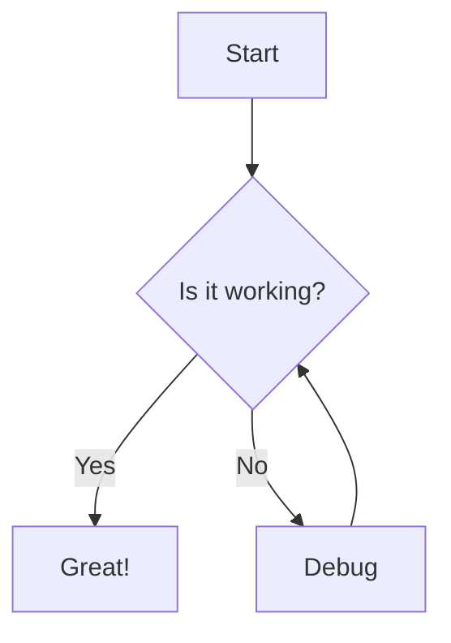

# mermaid-png

Convert [Mermaid](https://mermaid.js.org/) diagrams into PNG images from the command line or from JavaScript.

The renderer uses Puppeteer and the locally installed Mermaid package, so Mermaid itself is not loaded from a CDN at render time.

## Features

- Convert `.mmd` files to PNG
- Use the CLI with Node.js or Bun
- Use the converter programmatically from JavaScript
- Render with Mermaid themes: `default`, `dark`, `forest`, and `neutral`
- Control output scale for higher-resolution images
- Set a custom or transparent background
- Batch-convert multiple Mermaid files
- Automatically create missing output directories
- Keep Puppeteer's browser sandbox enabled by default

## Requirements

- Node.js or Bun
- npm or Bun for installing dependencies
- A browser supported by Puppeteer

Puppeteer may download a compatible browser during dependency installation.

## Installation

Clone the repository and install its dependencies:

```bash
git clone https://github.com/plicey/mermaid-png.git
cd mermaid-png
npm install
```

Or with Bun:

```bash
bun install
```

## Quick start

Convert the included sample diagram:

```bash
node mermaid-to-png.js sample-diagram.mmd
```

Or with Bun:

```bash
bun mermaid-to-png.js sample-diagram.mmd
```

If no output path is supplied, the input extension is replaced with `.png`. For example, `sample-diagram.mmd` becomes `sample-diagram.png`.

## CLI usage

```text
mmdpng <input.mmd> [output.png] [options]
```

You can also run the script directly:

```bash
node mermaid-to-png.js <input.mmd> [output.png] [options]
# or
bun mermaid-to-png.js <input.mmd> [output.png] [options]
```

### CLI options

| Option | Description | Default |
| --- | --- | --- |
| `--theme <theme>` | Mermaid theme: `default`, `dark`, `forest`, or `neutral` | `default` |
| `--scale <factor>` | Device scale factor used for higher-resolution output | `2` |
| `--bg <color>` | Background color, including `transparent` | `white` |
| `--no-sandbox` | Disable Puppeteer's browser sandbox | off |

### Examples

Use the default output name:

```bash
node mermaid-to-png.js diagram.mmd
```

Choose an output file:

```bash
node mermaid-to-png.js diagram.mmd output.png
```

Render with a dark theme at a larger scale:

```bash
node mermaid-to-png.js diagram.mmd output.png --theme dark --scale 3
```

Use a transparent background:

```bash
node mermaid-to-png.js diagram.mmd output.png --bg transparent
```

### Install the `mmdpng` command globally

The package declares `mmdpng` as its CLI binary. From the repository directory, you can install it globally with npm:

```bash
npm install -g .
mmdpng sample-diagram.mmd
```

## Programmatic usage

The module exports `mermaidToPng`, `convertFile`, and `batchConvert`.

### Render Mermaid source

```js
const { mermaidToPng } = require('./mermaid-to-png');

await mermaidToPng(
  `graph TD
    A[Start] --> B[Render PNG]`,
  'output.png',
  {
    theme: 'default',
    backgroundColor: 'white',
    scale: 2,
  }
);
```

### Convert a file

```js
const { convertFile } = require('./mermaid-to-png');

await convertFile('diagram.mmd', 'output/diagram.png', {
  theme: 'forest',
  scale: 2,
});
```

When `outputPath` is omitted, the input file extension is replaced with `.png`.

### Batch conversion

```js
const { batchConvert } = require('./mermaid-to-png');

const results = await batchConvert(
  ['architecture.mmd', 'sequence.mmd'],
  'output',
  { theme: 'neutral', scale: 2 }
);

console.log(results);
```

Each batch result reports the input path and whether conversion succeeded. Successful entries include the output path; failed entries include the error message.

## API options

The rendering functions accept an options object with these properties:

| Property | Type | Default | Description |
| --- | --- | --- | --- |
| `backgroundColor` | `string` | `white` | Page background color; use `transparent` for transparent output |
| `theme` | `string` | `default` | Mermaid theme |
| `scale` | `number` | `2` | Puppeteer device scale factor |
| `noSandbox` | `boolean` | `false` | Disable Puppeteer's sandbox |

## Example Mermaid file

Create a file such as `diagram.mmd`:



Then render it:

```bash
node mermaid-to-png.js diagram.mmd
```

## Security

The renderer uses Mermaid's `strict` security level and keeps Puppeteer's sandbox enabled by default.

Only use `--no-sandbox` (or `noSandbox: true`) when your environment requires it and you trust the Mermaid input and execution environment. Disabling the browser sandbox reduces isolation.

## How it works

1. Reads Mermaid source from a file or string.
2. Loads the locally installed `mermaid.min.js`.
3. Opens a headless browser with Puppeteer.
4. Renders the diagram as SVG in a temporary page.
5. Screenshots the rendered diagram to PNG.
6. Writes the PNG to the requested output path.

## Project files

- `mermaid-to-png.js` — CLI and JavaScript API
- `sample-diagram.mmd` — example Mermaid diagram
- `package.json` — package metadata, dependencies, and `mmdpng` binary definition

## Contributing

Issues and pull requests are welcome. When changing CLI behavior, keep the command-line help and README examples in sync.
